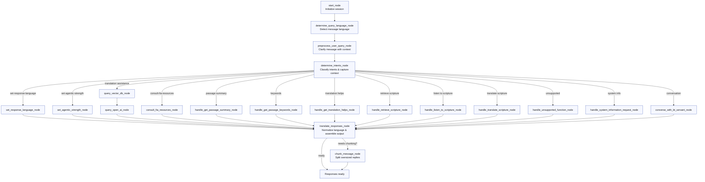

# bt-servant-engine

An AI-powered WhatsApp assistant for Bible translators. The service runs on FastAPI, orchestrates intent handling with LangGraph, and integrates OpenAI models plus ChromaDB-backed resources to answer translation questions in multiple languages.

---

## Overview
- **Messaging Surface:** Meta WhatsApp webhooks handled by `bt_servant_engine.apps.api`.
- **Architecture:** Strict onion/hexagonal layers enforced by Import Linter (core → services → adapters → apps).
- **Brain:** LangGraph pipeline defined in `bt_servant_engine.services.brain_orchestrator`.
- **LLM & Retrieval:** OpenAI Responses API + ChromaDB adapters accessed through dependency-injected service container.
- **Quality Gates:** `scripts/check_repo.sh` runs formatting, linting, typing, security, dependency, and coverage checks with zero suppressions allowed.

---

## Architecture

### Layered Layout
- **`bt_servant_engine/core`** – Domain models, enums, configuration, logging, and service ports. Pure Python with no infrastructure dependencies.
- **`bt_servant_engine/services`** – Application logic: LangGraph nodes, preprocessing, intent handlers, passage/response pipelines, progress messaging, and import-linter contracts.
- **`bt_servant_engine/adapters`** – Infrastructure integrations (ChromaDB, messaging transports, user state persistence, OpenAI client wrappers).
- **`bt_servant_engine/apps`** – FastAPI application, routes, and request/response DTOs.
- **`bt_servant_engine/api_factory.py`** – Public entrypoint returning a FastAPI app wired to the default service container.
- **`bt_servant_engine/bootstrap.py`** – Builds the dependency container that wires ports to adapters. Tests can override this for fakes.
- **`utils/`** – Shared utilities (pricing, identifiers, perf tracing, etc.) that remain infrastructure-agnostic.

Architectural boundaries are enforced by `.importlinter` contracts and validated automatically via the `lint-imports` check in pre-commit/CI.

### Dependency Wiring
```text
FastAPI (apps) → Services → Core
           ↘         ↘
         Adapters ← Ports (core)
```
- Applications only talk to services and ports.
- Services depend on core models/ports and call adapters through injected dependencies.
- Adapters implement the core ports and encapsulate all IO (Meta, Chroma, storage, OpenAI).

---

## LangGraph Decision Flow
The brain graph processes each inbound WhatsApp message through a series of deterministic steps. Mermaid rendering is supported natively by GitHub, so the flowchart below reflects the live graph assembled in `create_brain()`.



Key traits:
- Intents can be processed sequentially, with lower-priority ones queued for continuation prompts.
- Every node returns a delta of state updates—no in-place LangGraph mutations.
- `translate_responses_node` centralizes language normalization and dedupes progress messages before chunking as needed.

---

## Supported Intents & Behaviors
- `get-bible-translation-assistance` – Retrieval-augmented answers using ChromaDB + OpenAI.
- `consult-fia-resources` – Pulls curated translation helps from FIA repositories.
- `get-passage-summary` – Summarizes canonical passages with faithful prose.
- `get-passage-keywords` – Surfaces keyword lists for a passage.
- `get-translation-helps` – Highlights typical translation challenges.
- `retrieve-scripture` / `listen-to-scripture` – Returns text or audio for passages.
- `translate-scripture` – Generates draft translations with agentic strength controls.
- `set-response-language` / `set-agentic-strength` – Session-level configuration.
- `retrieve-system-information` – Answers questions about capabilities, privacy, etc.
- `perform-unsupported-function` – Graceful fallback when intent is unrecognized.
- `converse-with-bt-servant` – General chat when no structured intent matches.

All intent handlers live in `bt_servant_engine.services.intents` and rely on shared passage/response pipelines.

---

## Running the API Locally
1. Create a virtual environment and install dependencies:
   ```bash
   python -m venv .venv
   source .venv/bin/activate  # Windows: .venv\Scripts\activate
   scripts/init_env.sh        # Installs runtime + dev tooling
   ```
2. Copy `env.example` to `.env` and populate required keys (Meta WhatsApp tokens, `OPENAI_API_KEY`, storage paths, etc.).
3. Launch the FastAPI app (this factory injects the default service container):
   ```bash
   uvicorn bt_servant_engine.api_factory:create_app --factory --reload --host 127.0.0.1 --port 8080
   ```
4. For PyCharm or VS Code launch configs, point to the same factory path (`bt_servant_engine.api_factory:create_app`).

Use a tunneling tool (e.g., ngrok) to expose `/meta-whatsapp` when testing webhook flows from Meta.

---

## Quality Gates & Tooling
- **One command for everything:** `scripts/check_repo.sh`  
  Runs ruff format/check, pylint, mypy, pyright, lint-imports, bandit, deptry, pip-audit, and pytest with coverage (`--cov-fail-under=70`). Treat any finding as a failure—no suppressions.
- **Pre-commit hooks:** install with `pre-commit install` and `pre-commit install --hook-type pre-push`. Hooks call the same script.
- **Import Linter:** validates onion boundaries; run manually with `lint-imports` if you need a fast architecture check.
- **Perf tracing utilities:** `utils/perf.py` instruments spans/costs for field debugging.

---

## Testing
- Default suite (excludes live OpenAI calls):
  ```bash
  pytest --maxfail=1 --disable-warnings -q -m "not openai"
  ```
- Full checks before committing:
  ```bash
  scripts/check_repo.sh
  ```
- Opt-in OpenAI validation (requires real `OPENAI_API_KEY` + `RUN_OPENAI_API_TESTS=1`):
  ```bash
  RUN_OPENAI_API_TESTS=1 pytest -q -m openai
  ```

Pytest marks warnings as errors; update fixtures or add targeted `filterwarnings` entries if necessary.

---

## WhatsApp & Admin Endpoints
- **Webhook:** `POST /meta-whatsapp` (signature verification + LangGraph processing). Verification handshake uses `GET /meta-whatsapp`.
- **Progress messaging:** Status texts sourced from `bt_servant_engine.services.status_messages`.
- **Admin API:** See `bt_servant_engine.apps.api.routes.admin` for vector store maintenance (collection merges, document management) secured via bearer token headers when `ENABLE_ADMIN_AUTH=True`.

---

## Data & Resources
- **Bible passages:** JSON assets under `sources/bible_data`.
- **Keyword data:** Cached term indexes in `sources/keyword_data`.
- **Visualizations:** Legacy PNG graphs remain in `visualizations/` for reference, but the authoritative graph lives in the Mermaid diagram above.

---

## Deployment Notes
- Build images using the existing Dockerfile/entrypoint, which invoke `bt_servant_engine.api_factory:create_app`.
- CI pipelines (GitHub Actions) run `scripts/check_repo.sh` and pytest coverage; OpenAI tests stay opt-in to avoid external side effects.

---

## Getting Help
- Review `docs/` for architecture decisions and refactor history (`docs/refactor_plan_revised.md`).
- `AGENTS.md` tracks ongoing decisions for future collaborators.
- Use the logging IDs (cid/user_id/trace) printed in the console to correlate webhook requests with OpenAI costs and continuation prompts.

Happy translating!
