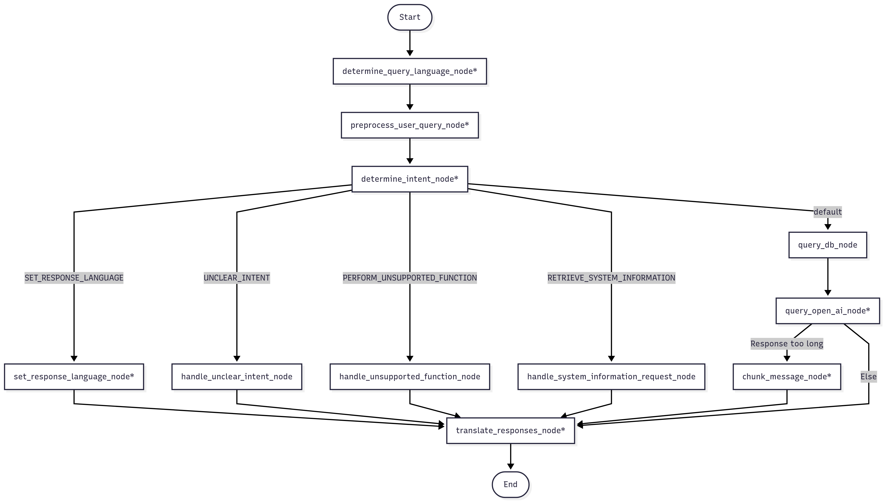

# bt-servant-engine

An AI-powered WhatsApp assistant for Bible translators, now powered by **Meta's Cloud API** (no more Twilio!). The assistant uses FastAPI, OpenAI, and ChromaDB to answer Bible translation questions in multiple languages.

---
## How the Decision Graph Works (brain.py)
The decision graph below defines the flow of a Bible translation assistant that uses a Retrieval-Augmented Generation (RAG) pipeline to respond to user messages intelligently and faithfully. Each node represents a distinct step in the processing pipeline, and transitions between them are determined either linearly or conditionally based on user input and system state.


**Nodes making LLM API calls*

*Grey boxes represent current user 'Intents'*

## Node Summaries
- **start_node:** Detects if its the first interaction with the user and, if so, adds welcome information to the list of responses passed through the graph.
- **determine_query_language_node:** Detects the language of the user's message to support multilingual responses and select the appropriate document collection. 
- **preprocess_user_query_node:** Clarifies the user's message using past conversation context, correcting ambiguity and minor issues while preserving intent.
- **determine_intents_node:** Classifies the user's message into one or more predefined intents: get-bible-translation-assistance, perform-unsupported-function, retrieve-system-information, set-response-language, or converse-with-bt-servant.  
- **set_response_language_node:** Updates the user's preferred response language in persistent storage.
- **query_db_node:** Searches relevant ChromaDB document collections using the transformed query, applying a relevance filter to determine if results are useful.
- **query_open_ai_node:** Uses OpenAI (with context from Chroma DB RAG results and chat history) to generate a response. Conditional logic routes long responses to chunking (splitting responses to sizes acceptable by Meta).
- **chunk_message_node:** If the assistant's response exceeds the 1500-character limit imposed by WhatsApp, this node semantically chunks the message into smaller parts.
- **translate_responses_node:** Translates the assistant's final output into the user’s preferred language, if needed. If more than one intent was processed, this node also makes a call resulting in the consolidation of all the responses into one message.
- **handle_unsupported_function_node:** Inform the user that the requested function is not supported and let the user know what the system actually can do.
- **handle_system_information_request_node:** This node handles user questions about the assistant itself — such as what it can do, how it works, or what resources it uses. When this intent is detected, the system loads a predefined system prompt that frames the assistant as a helpful RAG-based servant to Bible translators. The assistant uses this context to generate a response strictly limited to the help docs.
- **converse_with_bt_servant_node:** This node handles general conversation with the user, like when the user simply says "what's up?!"

## How intents are determined and processed
The assistant uses a dedicated node (determine_intents_node) to classify the user’s message into one or more high-level intents, which are used to determine the next step in the assistant’s response pipeline. This node relies on the OpenAI model (gpt-4o) to parse the message in context. It sends the following structured input to the model:

- The current user message (already preprocessed and clarified). 
- Chat history (max five turns back), if available, so the model can detect intent based on prior interactions.

The model receives a tightly constrained system prompt instructing it to always return one or more intents, using a fixed enumeration. The model’s response is parsed (by the LLM) into a list of valid IntentType enum values. If multiple intents are encountered, the graph (Langgraph) later processes them *in parallel*, and a later node aggregates the responses into a single cohesive response.

## Current Supported User Intents
- get-bible-translation-assistance (all questions about the bible, bible translation, etc. Example: "Summarize Titus 2.")
- perform-unsupported-function (some attempt to invoke non-existent functionality. Example: "Teach me how to play football")
- retrieve-system-information (an attempt to learn about the system or receive help to do something. Example: "Help!")
- specify-response-language (an attempt to set the response language. Example: "Set my response language to English")
- converse-with-bt-servant (an attempt to engage in normal conversation with the bot. Example: "What's up BT Servant?!")

## How Intents Drive the Decision Graph
The extracted intent(s) are used by the function process_intents(state) to conditionally branch to the appropriate node in the LangGraph. If multiple intents were detected, they are processed in parallel (using Langgraph's fan-out/fan-in paradigm/functionality). Here’s how different intents affect the flow:
- **get-bible-translation-assistance** → Route to query_db_node, which kicks off the full RAG pipeline.
- **set-response-language** → Routes to set_response_language_node, which updates the user’s language preference and skips retrieval/generation. 
- **retrieve-system-information** → Routes to handle_system_information_request_node, which uses help docs and a special system prompt to answer.
- **perform-unsupported-function** → Routes to handle_unsupported_function_node, a graceful fallback that informs the user the function isn't supported, and provides information detailing what the system can do.
- **converse-with-bt-servant** → Routes to converse_with_bt_servant_node, where a conversational response is added to the list of responses being gathered. 

## Environment Setup

Prerequisites:
- Python 3.12+

This app uses a `.env` file for local development.

### Step-by-Step Setup (Local)

1. **Create a `.env` file**

```bash
cp env.example .env
```

2. **Edit your `.env`**

Fill in the required values:

```env
OPENAI_API_KEY=sk-...
META_VERIFY_TOKEN=your-verify-token-here
META_WHATSAPP_TOKEN=your-meta-access-token-here
META_PHONE_NUMBER_ID=your-meta-phone-number-id
BASE_URL=https://your.public.domain
GROQ_API_KEY=gsk_IJ...
```

> All five above variables are required for the Meta Cloud API to work properly.

3. **Install dependencies**

```bash
pip install -r requirements.txt
```

4. **Run the app**

```bash
uvicorn bt_servant:app --reload
```

---

## Environment Variables Explained

| Variable               | Purpose                                                         |
|------------------------|-----------------------------------------------------------------|
| `OPENAI_API_KEY`       | Auth token for OpenAI's GPT models                              |
| `GROQ_API_KEY`       | Auth token for Groq models                                      |
| `META_VERIFY_TOKEN`    | Custom secret used for Meta webhook verification                |
| `META_WHATSAPP_TOKEN`  | Access token used to send messages via Meta API                 |
| `META_PHONE_NUMBER_ID` | Phone number ID tied to Meta app/WABA                           |
| `BASE_URL`      | Public base URL used to generate audio file links               |
| `BT_SERVANT_LOG_LEVEL` | (Optional) Defaults to info log level if not present            |
| `IN_META_SANDBOX_MODE` | (Optional) Set to true when testing in sandbox mode             |
| `META_SANDBOX_PHONE_NUMBER` | Only accept requests from this phonenumber when testing locally |
| `OPENAI_PRICING_JSON`  | (Optional) Per-million token pricing to compute costs in perf reports |

Other acceptable values for log level: critical, error, warning, and debug

---

## Pricing Defaults

- The engine computes token and cost totals in its performance reports. By default, it uses the following pricing for `gpt-4o` if no environment override is provided:

```
OPENAI_PRICING_JSON='{"gpt-4o": {"input_per_million": 2.5, "output_per_million": 10.0, "cached_input": 1.25}}'
```

- To override (e.g., if pricing changes), set `OPENAI_PRICING_JSON` in your environment or `.env` to a JSON object mapping model names to per‑million rates:

```
OPENAI_PRICING_JSON='{"gpt-4o": {"input_per_million": 2.5, "output_per_million": 10.0, "cached_input": 1.25}, "gpt-4o-mini": {"input_per_million": 0.15, "output_per_million": 0.6}}'
```

- Notes:
  - Extra keys like `cached_input` are optional; when provided and the SDK reports cache-read tokens, discounted costs are included.
  - Explicit env values always override the built-in default.


## Webhook Setup

Set your webhook URL in the [Meta Developer Console](https://developers.facebook.com/) under your WhatsApp App configuration:

- **Callback URL**: `https://<your-domain>/meta-whatsapp`
- **Verify Token**: Must match `META_VERIFY_TOKEN` in your `.env`

---

## Testing Locally

You can test message flow locally using tools like [ngrok](https://ngrok.com/) to expose `localhost:8000` to the public internet, then set your webhook in Meta to use the `https://<ngrok-url>/meta-whatsapp` endpoint.

---

## Chroma API Endpoints

These endpoints manage and inspect ChromaDB collections used by the assistant. When `ENABLE_ADMIN_AUTH=True`, include an admin token via either `Authorization: Bearer <token>` or `X-Admin-Token: <token>`.

- `GET /chroma/collections`: List all collection names.
- `POST /chroma/collections` body: `{ "name": "<collection>" }`: Create a collection.
- `DELETE /chroma/collections/{name}`: Delete a collection.
- `GET /chroma/collections/{name}/count`: Return document count in a collection.
- `GET /chroma/collection/{name}/ids`: Return all document IDs in a collection.
- `DELETE /chroma/collections/{name}/documents/{document_id}`: Delete a specific document.
- `POST /chroma/collections/{dest}/merge`: Start a background merge of one collection into another.
- `GET /chroma/merge-tasks/{task_id}`: Get status of a merge task.
- `DELETE /chroma/merge-tasks/{task_id}`: Cancel a merge task (best-effort).
- `POST /chroma/add-document` (alias: `POST /add-document`) body:
  `{ "document_id": "<id>", "collection": "<name>", "name": "<doc name>", "text": "...", "metadata": { ... } }`

Example: fetch document IDs for a collection

```bash
curl -s \
  -H "Authorization: Bearer $ADMIN_API_TOKEN" \
  http://localhost:8000/chroma/collection/uw_translation_notes/ids | jq .
```

Response

```json
{
  "collection": "uw_translation_notes",
  "count": 67819,
  "ids": ["tn_ACT_vcsw", "..."]
}
```

### Merge collections

Start a merge with dry-run to preview duplicates and plan:

```bash
curl -s \
  -H "Authorization: Bearer $ADMIN_API_TOKEN" \
  -H "Content-Type: application/json" \
  -X POST http://localhost:8000/chroma/collections/dest/merge \
  -d '{
        "source": "src",
        "on_duplicate": "fail",
        "dry_run": true,
        "duplicates_preview_limit": 100
      }' | jq .
```

Run a merge that creates unified numeric IDs in the dest, with modest throttling and default re-embed:

```bash
curl -s \
  -H "Authorization: Bearer $ADMIN_API_TOKEN" \
  -H "Content-Type: application/json" \
  -X POST http://localhost:8000/chroma/collections/dest/merge \
  -d '{
        "source": "src",
        "mode": "copy",
        "create_new_id": true,
        "batch_size": 1000,
        "sleep_between_batches_ms": 100
      }' | jq .
```

Faster copy that reuses source embeddings (dimensions must match), skipping duplicates:

```bash
curl -s \
  -H "Authorization: Bearer $ADMIN_API_TOKEN" \
  -H "Content-Type: application/json" \
  -X POST http://localhost:8000/chroma/collections/dest/merge \
  -d '{
        "source": "src",
        "use_source_embeddings": true,
        "on_duplicate": "skip"
      }' | jq .
```

Poll or cancel a running merge task:

```bash
curl -s -H "Authorization: Bearer $ADMIN_API_TOKEN" http://localhost:8000/chroma/merge-tasks/<task_id> | jq .
curl -s -H "Authorization: Bearer $ADMIN_API_TOKEN" -X DELETE http://localhost:8000/chroma/merge-tasks/<task_id> | jq .
```

Status response includes progress and ETA metrics:

```json
{
  "task_id": "...",
  "source": "src",
  "dest": "dest",
  "status": "running",
  "total": 12345,
  "completed": 2100,
  "skipped": 0,
  "overwritten": 0,
  "deleted_from_source": 0,
  "docs_per_second": 85.2,
  "eta_seconds": 120.5,
  "eta_at": 1736455123.42
}
```
\- `docs_per_second` is an average since the task started.
\- `eta_seconds` and `eta_at` are estimates; values may fluctuate as batches complete.
