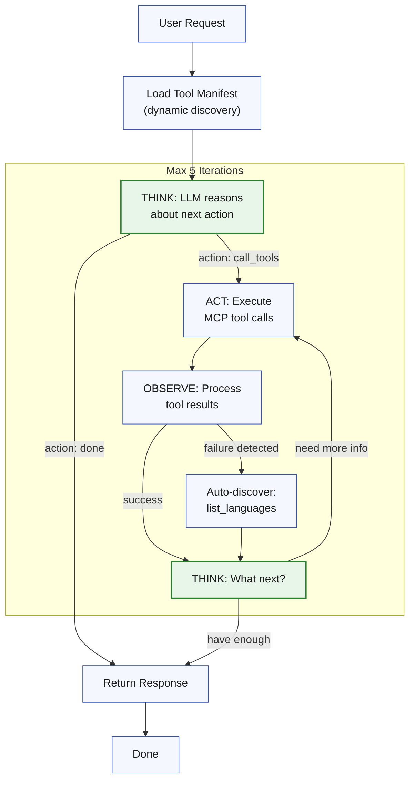

# bt-servant-engine

A client-agnostic REST API for Bible translation assistance. The service runs on FastAPI, orchestrates intent handling with LangGraph, and integrates OpenAI models plus ChromaDB-backed resources to answer translation questions in multiple languages.

---

## Overview
- **API Surface:** RESTful endpoints at `/api/v1/` for chat, user preferences, and admin functions.
- **Architecture:** Strict onion/hexagonal layers enforced by Import Linter (core → services → adapters → apps).
- **Brain:** LangGraph pipeline defined in `bt_servant_engine.services.brain_orchestrator`.
- **LLM & Retrieval:** OpenAI Responses API + ChromaDB adapters accessed through dependency-injected service container.
- **Quality Gates:** `scripts/check_repo.sh` runs formatting, linting, typing, security, dependency, and coverage checks with zero suppressions allowed.

---

## Client Integration

The engine is **client-agnostic**—it provides a REST API that any messaging platform can integrate with. Client gateways (web apps, messaging platforms, CLI tools) are responsible for:

1. **User authentication** – The engine trusts the `user_id` provided by authenticated clients
2. **Message transport** – Receiving messages from users and delivering responses back
3. **Media handling** – Converting platform-specific formats (e.g., voice messages) to the engine's expected format

### Integration Flow
```
┌─────────────┐     POST /api/v1/chat      ┌─────────────┐
│   Client    │ ─────────────────────────> │   Engine    │
│   Gateway   │ <───────────────────────── │             │
└─────────────┘     JSON response          └─────────────┘
       │                                          │
       │         POST /progress-callback          │
       │ <─────────────────────────────────────── │
       │         (optional, during processing)    │
```

### Authentication
- Clients authenticate to the engine using `Authorization: Bearer <ADMIN_API_TOKEN>`
- The same token is echoed back in progress callbacks via `X-Engine-Token` header for verification

---

## Architecture

### Layered Layout
- **`bt_servant_engine/core`** – Domain models, enums, configuration, logging, and service ports. Pure Python with no infrastructure dependencies.
- **`bt_servant_engine/services`** – Application logic: LangGraph nodes, preprocessing, intent handlers, passage/response pipelines, progress messaging, and import-linter contracts.
- **`bt_servant_engine/adapters`** – Infrastructure integrations (ChromaDB, messaging transports, user state persistence, OpenAI client wrappers).
- **`bt_servant_engine/apps`** – FastAPI application, routes, and request/response DTOs.
- **`bt_servant_engine/api_factory.py`** – Public entrypoint returning a FastAPI app wired to the default service container.
- **`bt_servant_engine/bootstrap.py`** – Builds the dependency container that wires ports to adapters. Tests can override this for fakes.
- **`utils/`** – Shared utilities (pricing, identifiers, perf tracing, etc.) that remain infrastructure-agnostic.

Architectural boundaries are enforced by `.importlinter` contracts and validated automatically via the `lint-imports` check in pre-commit/CI.

### Dependency Wiring
```text
FastAPI (apps) → Services → Core
           ↘         ↘
         Adapters ← Ports (core)
```
- Applications only talk to services and ports.
- Services depend on core models/ports and call adapters through injected dependencies.
- Adapters implement the core ports and encapsulate all IO (Chroma, user state storage, OpenAI).

---

## LangGraph Decision Flow
The brain graph processes each inbound message through a series of deterministic steps. Mermaid rendering is supported natively by GitHub, so the flowchart below reflects the live graph assembled in `create_brain()`.


Key traits:
- Intents can be processed sequentially, with lower-priority ones queued for continuation prompts.
- Every node returns a delta of state updates—no in-place LangGraph mutations.
- `translate_responses_node` centralizes language normalization and dedupes progress messages before chunking as needed.

---

## Supported Intents & Behaviors
- `get-bible-translation-assistance` – Retrieval-augmented answers using ChromaDB + OpenAI.
- `consult-fia-resources` – Pulls curated translation helps from FIA repositories.
- `get-passage-summary` – Summarizes canonical passages with faithful prose.
- `get-passage-keywords` – Surfaces keyword lists for a passage.
- `get-translation-helps` – Highlights typical translation challenges.
- `retrieve-scripture` / `listen-to-scripture` – Returns text or audio for passages.
- `translate-scripture` – Generates draft translations with agentic strength controls.
- `set-response-language` / `set-agentic-strength` – Session-level configuration.
- `retrieve-system-information` – Answers questions about capabilities, privacy, etc.
- `perform-unsupported-function` – Graceful fallback when intent is unrecognized.
- `converse-with-bt-servant` – General chat when no structured intent matches.

All intent handlers live in `bt_servant_engine.services.intents` and rely on shared passage/response pipelines.

---

## Agentic MCP Workflow (Translation Helps)

When `BT_DEV_AGENTIC_MCP=true`, the engine uses a ReAct (Reason + Act) agentic loop to orchestrate calls to the Translation Helps MCP server. This enables dynamic, multi-step workflows for Bible translation assistance.

### Architecture Overview

```
┌─────────────────────────────────────────────────────────────────────────────┐
│                           bt-servant-engine                                  │
│  ┌─────────────────────────────────────────────────────────────────────┐    │
│  │                         ReAct Agent Loop                             │    │
│  │                                                                      │    │
│  │   ┌──────────┐    ┌──────────┐    ┌──────────┐                      │    │
│  │   │  THINK   │───>│   ACT    │───>│ OBSERVE  │──┐                   │    │
│  │   │  (LLM)   │    │  (Tools) │    │ (Results)│  │                   │    │
│  │   └──────────┘    └──────────┘    └──────────┘  │                   │    │
│  │        ^                                         │                   │    │
│  │        └─────────────────────────────────────────┘                   │    │
│  │                    (repeat until done)                               │    │
│  └─────────────────────────────────────────────────────────────────────┘    │
│                                    │                                         │
│                                    │ MCP Protocol                            │
│                                    ▼                                         │
└────────────────────────────────────┼─────────────────────────────────────────┘
                                     │
                                     ▼
┌─────────────────────────────────────────────────────────────────────────────┐
│                      Translation Helps MCP Server                            │
│                     (tc-helps.mcp.servant.bible)                            │
│                                                                              │
│  ┌─────────────────────────────────────────────────────────────────────┐    │
│  │                         Available Tools                              │    │
│  │                                                                      │    │
│  │  Discovery:                    Fetch:                                │    │
│  │  ├─ list_languages             ├─ fetch_scripture                    │    │
│  │  ├─ list_subjects              ├─ fetch_translation_notes            │    │
│  │  ├─ list_resources_for_language├─ fetch_translation_word_links       │    │
│  │  └─ search_translation_word_   ├─ fetch_translation_word             │    │
│  │     across_languages           ├─ fetch_translation_academy          │    │
│  │                                └─ fetch_translation_questions        │    │
│  └─────────────────────────────────────────────────────────────────────┘    │
│                                    │                                         │
│                                    ▼                                         │
│                           Door43 Content Service                             │
└─────────────────────────────────────────────────────────────────────────────┘
```

### ReAct Loop Flow

The agent follows a Think → Act → Observe cycle (max 5 iterations by default):



### Key Design Principles

1. **No Hardcoded Whitelists**: Tools are discovered dynamically from the MCP manifest at runtime
2. **Agent Orchestrates**: The ReAct agent decides which tools to call and in what order
3. **Discovery on Demand**: For common languages (en, es, fr), tries direct fetch; discovers available resources on failure
4. **Language Fallback**: Falls back to English when resources unavailable, with logged warnings

### Example Workflow: "Translation helps for Matthew 5:3"

```
┌─────────────────────────────────────────────────────────────────────────────┐
│ Iteration 1                                                                  │
├─────────────────────────────────────────────────────────────────────────────┤
│ THINK: "User wants translation helps for Matthew 5:3. I need to fetch       │
│         scripture text and translation notes. Let me call multiple tools."  │
│                                                                              │
│ ACT:   → fetch_scripture(reference="mat 5:3", language="en")                │
│        → fetch_translation_notes(reference="mat 5:3", language="en")        │
│        → fetch_translation_word_links(reference="mat 5:3", language="en")   │
│                                                                              │
│ OBSERVE: ✓ Scripture: "Blessed are the poor in spirit..."                   │
│          ✓ Notes: [key translation considerations]                          │
│          ✓ Word links: [makarios, ptochos, pneuma]                          │
└─────────────────────────────────────────────────────────────────────────────┘
                                    │
                                    ▼
┌─────────────────────────────────────────────────────────────────────────────┐
│ Iteration 2                                                                  │
├─────────────────────────────────────────────────────────────────────────────┤
│ THINK: "I have scripture and notes. The word links show important terms.    │
│         Let me fetch definitions for 'makarios' (blessed) and 'ptochos'     │
│         (poor) to provide comprehensive help."                              │
│                                                                              │
│ ACT:   → fetch_translation_word(term="makarios", language="en")             │
│        → fetch_translation_word(term="ptochos", language="en")              │
│                                                                              │
│ OBSERVE: ✓ makarios: "blessed, happy, fortunate..."                         │
│          ✓ ptochos: "poor, needy, lacking..."                               │
└─────────────────────────────────────────────────────────────────────────────┘
                                    │
                                    ▼
┌─────────────────────────────────────────────────────────────────────────────┐
│ Iteration 3                                                                  │
├─────────────────────────────────────────────────────────────────────────────┤
│ THINK: "I now have everything needed to help with this passage:             │
│         - Scripture text                                                     │
│         - Translation notes with key considerations                          │
│         - Word definitions for key terms                                     │
│         I can provide a comprehensive response."                             │
│                                                                              │
│ ACTION: done                                                                 │
│                                                                              │
│ RESPONSE: "Matthew 5:3 says 'Blessed are the poor in spirit...'             │
│            Key translation considerations:                                   │
│            1. 'Blessed' (makarios) - means happy, fortunate...              │
│            2. 'Poor in spirit' (ptochos pneuma) - refers to..."             │
└─────────────────────────────────────────────────────────────────────────────┘
```

### Discovery Workflow (Unfamiliar Language)

When a user requests resources in an unfamiliar language:

```
┌─────────────────────────────────────────────────────────────────────────────┐
│ Iteration 1                                                                  │
├─────────────────────────────────────────────────────────────────────────────┤
│ THINK: "User wants translation notes in Amharic. I'm not sure what's        │
│         available. Let me try fetching directly first."                      │
│                                                                              │
│ ACT:   → fetch_translation_notes(reference="mat 5:3", language="am")        │
│                                                                              │
│ OBSERVE: ✗ Error: "Resource not found for language 'am'"                    │
│          → Auto-triggering discovery...                                      │
│          → list_languages() → [en, es-419, fr, sw, ...]                     │
└─────────────────────────────────────────────────────────────────────────────┘
                                    │
                                    ▼
┌─────────────────────────────────────────────────────────────────────────────┐
│ Iteration 2                                                                  │
├─────────────────────────────────────────────────────────────────────────────┤
│ THINK: "Amharic (am) is not in the available languages. I should fall       │
│         back to English and note this in my response."                       │
│                                                                              │
│ ACT:   → fetch_translation_notes(reference="mat 5:3", language="en")        │
│                                                                              │
│ OBSERVE: ✓ Notes: [translation considerations in English]                   │
│          ⚠ Logged: "Language fallback: am → en (resource_unavailable)"      │
└─────────────────────────────────────────────────────────────────────────────┘
                                    │
                                    ▼
┌─────────────────────────────────────────────────────────────────────────────┐
│ Iteration 3                                                                  │
├─────────────────────────────────────────────────────────────────────────────┤
│ ACTION: done                                                                 │
│                                                                              │
│ RESPONSE: "Translation notes for Matthew 5:3 (Note: Amharic resources       │
│            are not yet available; showing English): ..."                     │
└─────────────────────────────────────────────────────────────────────────────┘
```

### Configuration

| Environment Variable | Default | Description |
|---------------------|---------|-------------|
| `BT_DEV_AGENTIC_MCP` | `false` | Enable/disable ReAct agentic mode |
| `MCP_SERVER_URL` | (SDK default) | Translation Helps MCP server URL |
| `REACT_MAX_ITERATIONS` | `5` | Maximum Think→Act→Observe cycles |
| `REACT_THINK_MODEL` | `gpt-4o` | LLM model for reasoning |
| `REACT_TOOL_MAX_CHARS` | `5000` | Max characters per tool response |
| `REACT_TOTAL_MAX_CHARS` | `15000` | Max total content across all tools |
| `REACT_FALLBACK_LANGUAGE` | `en` | Language to use when requested unavailable |

### Logging

All ReAct operations emit structured logs for debugging and verification:

```json
{"event": "[react-mcp] Starting ReAct loop", "intent": "get-translation-helps", "max_iterations": 5}
{"event": "[react-mcp] Loaded tools from manifest", "tool_count": 11, "tools": ["list_languages", ...]}
{"event": "[react-mcp] Iteration starting", "iteration": 1}
{"event": "[react-mcp] Think result", "iteration": 1, "action": "call_tools", "tool_count": 3}
{"event": "[react-mcp] Calling tool", "tool": "fetch_scripture", "args": {"reference": "mat 5:3"}}
{"event": "[react-mcp] Tool completed", "tool": "fetch_scripture", "success": true, "elapsed_ms": 234.5}
{"event": "[react-mcp] Observation", "iteration": 1, "tool": "fetch_scripture", "success": true}
{"event": "[react-mcp] Loop complete - agent done", "iteration": 3, "total_elapsed_ms": 1523.7}
```

### Intents Using Agentic MCP

When `BT_DEV_AGENTIC_MCP=true`, the following intents use the ReAct loop:

- `get-passage-summary` – Summarizes passages with translation context
- `get-passage-keywords` – Extracts key terms with definitions
- `get-translation-helps` – Comprehensive translation assistance
- `retrieve-scripture` – Fetches scripture text with notes

---

## Running the API Locally
1. Create a virtual environment and install dependencies:
   ```bash
   python -m venv .venv
   source .venv/bin/activate  # Windows: .venv\Scripts\activate
   scripts/init_env.sh        # Installs runtime + dev tooling
   ```
2. Copy `env.example` to `.env` and populate required keys (`OPENAI_API_KEY`, `ADMIN_API_TOKEN`, storage paths, etc.).
3. Launch the FastAPI app (this factory injects the default service container):
   ```bash
   uvicorn bt_servant_engine.api_factory:create_app --factory --reload --host 127.0.0.1 --port 8080
   ```
4. For PyCharm or VS Code launch configs, point to the same factory path (`bt_servant_engine.api_factory:create_app`).
5. Visit `http://localhost:8080/docs` to explore the API interactively.

---

## Quality Gates & Tooling
- **One command for everything:** `scripts/check_repo.sh`  
  Runs ruff format/check, pylint, mypy, pyright, lint-imports, bandit, deptry, pip-audit, and pytest with coverage (`--cov-fail-under=70`). Treat any finding as a failure—no suppressions.
- **Pre-commit hooks:** install with `pre-commit install` and `pre-commit install --hook-type pre-push`. Hooks call the same script.
- **Import Linter:** validates onion boundaries; run manually with `lint-imports` if you need a fast architecture check.
- **Perf tracing utilities:** `utils/perf.py` instruments spans/costs for field debugging.

---

## Testing
- Default suite (excludes live OpenAI calls):
  ```bash
  pytest --maxfail=1 --disable-warnings -q -m "not openai"
  ```
- Full checks before committing:
  ```bash
  scripts/check_repo.sh
  ```
- Opt-in OpenAI validation (requires real `OPENAI_API_KEY` + `RUN_OPENAI_API_TESTS=1`):
  ```bash
  RUN_OPENAI_API_TESTS=1 pytest -q -m openai
  ```

Pytest marks warnings as errors; update fixtures or add targeted `filterwarnings` entries if necessary.

---

## REST API Endpoints

### OpenAPI Documentation
FastAPI auto-generates interactive API docs. When running locally:
- **Swagger UI:** `http://localhost:8080/docs` - Interactive API explorer
- **ReDoc:** `http://localhost:8080/redoc` - Alternative documentation
- **OpenAPI JSON:** `http://localhost:8080/openapi.json` - Raw spec for code generation

### Core API (`/api/v1/`)
- **Chat:** `POST /api/v1/chat` - Main conversation endpoint (text and audio input/output)
  - Requires `Authorization: Bearer <ADMIN_API_TOKEN>` header
  - Request body: `{ "client_id": "...", "user_id": "...", "message": "...", "message_type": "text" }`
  - For audio: include `audio_base64` and set `message_type: "audio"`
  - Optional progress callbacks: include `progress_callback_url` to receive status updates during processing
- **User Preferences:** `GET/PUT /api/v1/users/{user_id}/preferences` - Manage response language, agentic strength

### Progress Callbacks
When a client provides `progress_callback_url` in the chat request, the engine will POST progress updates during long-running operations:
```json
{
  "user_id": "...",
  "message_key": "SEARCHING_RESOURCES",
  "text": "Searching translation resources...",
  "timestamp": 1234567890.0
}
```
- Callbacks include `X-Engine-Token` header with `ADMIN_API_TOKEN` for verification
- Callbacks are fire-and-forget (2s timeout) and won't block processing if they fail
- Control update frequency with `progress_throttle_seconds` (default: 3.0)

### Admin API
- **Progress messaging:** Status texts sourced from `bt_servant_engine.services.status_messages`.
- **Vector store & cache:** See `bt_servant_engine.apps.api.routes.admin_datastore` for collection merges, document management. Secured via bearer token when `ENABLE_ADMIN_AUTH=True`. Cache controls:
  - `POST /cache/clear` wipes every cache namespace.
  - `POST /cache/{name}/clear` clears an individual cache (e.g., `passage_summary`).
  - `GET /cache/stats` reports global cache settings, hit/miss counters, and disk usage.
  - `GET /cache/{name}?sample_limit=10` inspects a specific cache with recent entry metadata.
  - Both clear endpoints accept `older_than_days=<float>` to prune only entries older than the cutoff instead of nuking everything.
- **Status message cache (translations) admin routes:** manage the on-disk status/progress message cache stored in `DATA_DIR/status_messages_data.json` (admin token required).
  - List all translations: `GET /admin/status-messages`
  - Get one message’s translations: `GET /admin/status-messages/{message_key}`
  - Get all translations for a language: `GET /admin/status-messages/language/{language}`
  - Upsert a translation: `PUT /admin/status-messages/{message_key}/{language}` with body `{"text": "..."}` (cannot overwrite English).
  - Delete a translation: `DELETE /admin/status-messages/{message_key}/{language}` (cannot delete English).
  - Delete all translations for a language: `DELETE /admin/status-messages/language/{language}` (cannot delete English).
  - Examples (assuming `ADMIN_API_TOKEN` in env):
    ```bash
    TOKEN=$ADMIN_API_TOKEN

    # List all message keys and their translations
    curl -H "Authorization: Bearer $TOKEN" http://localhost:8080/admin/status-messages

    # Get all translations for a single message key
    curl -H "Authorization: Bearer $TOKEN" \
      http://localhost:8080/admin/status-messages/EXTRACTING_KEYWORDS

    # Get all message texts for a specific language across all keys
    curl -H "Authorization: Bearer $TOKEN" \
      http://localhost:8080/admin/status-messages/language/am

    # Upsert a translation for one key/language
    curl -X PUT -H "Authorization: Bearer $TOKEN" \
      -H "Content-Type: application/json" \
      -d '{"text":"Amharic text here"}' \
      http://localhost:8080/admin/status-messages/EXTRACTING_KEYWORDS/am

    # Delete a translation for one key/language
    curl -X DELETE -H "Authorization: Bearer $TOKEN" \
      http://localhost:8080/admin/status-messages/EXTRACTING_KEYWORDS/am

    # Delete all translations for a language across every key
    curl -X DELETE -H "Authorization: Bearer $TOKEN" \
      http://localhost:8080/admin/status-messages/language/am
    ```

---

## Cache Configuration
- Defaults: caching is enabled with a disk backend under `${DATA_DIR}/cache`, entries never expire (`TTL=-1`), and a 500 MB cap (per cache) enforced by environment variables.
- Toggle or tune via env settings (see `bt_servant_engine/core/config.py`):
  - `CACHE_ENABLED`, `CACHE_BACKEND` (`disk` | `memory`), `CACHE_DISK_MAX_BYTES`
  - Per-cache toggles (defaults in parentheses): `CACHE_SELECTION_ENABLED` (`false`), `CACHE_SUMMARY_ENABLED` (`true`), `CACHE_KEYWORDS_ENABLED` (`true`), `CACHE_TRANSLATION_HELPS_ENABLED` (`true`), `CACHE_RAG_VECTOR_ENABLED` (`false`), `CACHE_RAG_FINAL_ENABLED` (`false`)
  - Per-cache TTL/size controls: `CACHE_SELECTION_TTL_SECONDS`, `CACHE_SUMMARY_TTL_SECONDS`, `CACHE_TRANSLATION_HELPS_TTL_SECONDS`, etc. (set to `-1` for no expiry)
- Admin endpoints (above) can purge or inspect caches without redeploying; deleting the cache directory in `${DATA_DIR}/cache` also resets disk stores.

---

## Data & Resources
- **Bible passages:** JSON assets under `sources/bible_data`.
- **Keyword data:** Cached term indexes in `sources/keyword_data`.
- **Visualizations:** Legacy PNG graphs remain in `visualizations/` for reference, but the authoritative graph lives in the Mermaid diagram above.

---

## Deployment Notes
- Build images using the existing Dockerfile/entrypoint, which invoke `bt_servant_engine.api_factory:create_app`.
- CI pipelines (GitHub Actions) run `scripts/check_repo.sh` and pytest coverage; OpenAI tests stay opt-in to avoid external side effects.

---

## Getting Help
- Review `docs/` for architecture decisions, refactor history, and API roadmap.
- `AGENTS.md` tracks ongoing decisions for future collaborators.
- Use the logging IDs (cid/user_id/trace) printed in the console to correlate API requests with OpenAI costs and continuation prompts.

---

## Related Projects
- [bt-servant-web-client](https://github.com/unfoldingWord/bt-servant-web-client) – Web-based chat interface for the BT Servant engine
- [bt-servant-whatsapp-gateway](https://github.com/unfoldingWord/bt-servant-whatsapp-gateway) – WhatsApp integration gateway

Happy translating!
